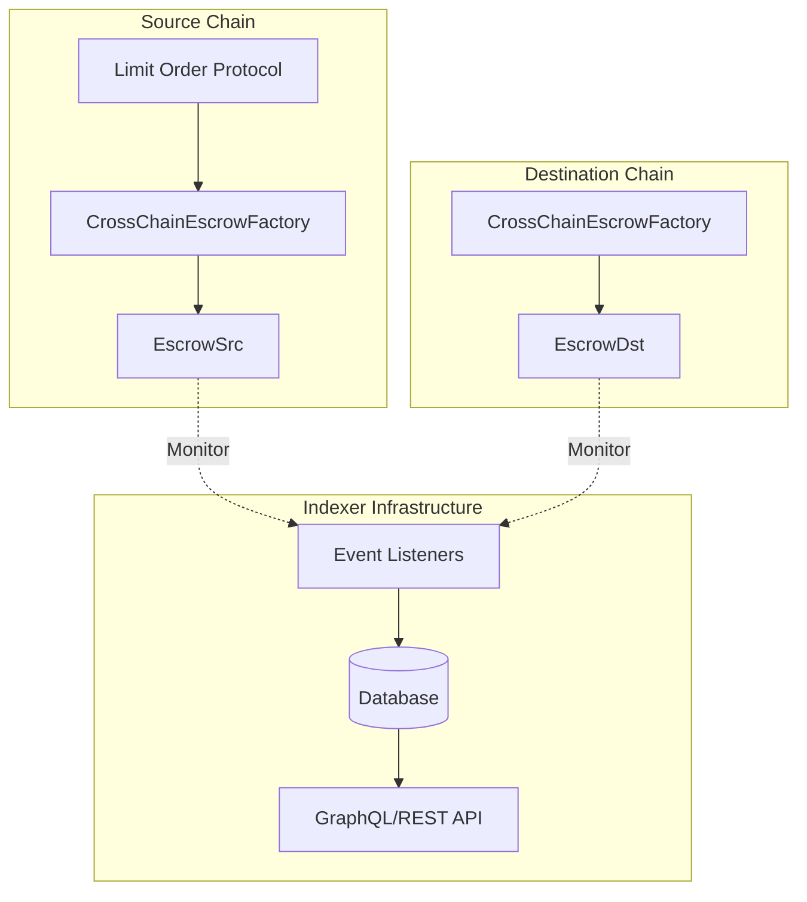

# Bridge-Me-Not Indexer Guide

## Overview

This guide provides comprehensive documentation for building indexers for the Bridge-Me-Not (BMN) protocol. The protocol operates across multiple chains, requiring careful coordination of event tracking and state management.

## Table of Contents

1. [Architecture Overview](#architecture-overview)
2. [Contract Deployments](#contract-deployments)
3. [Core Events](#core-events)
4. [Data Schemas](#data-schemas)
5. [Cross-Chain Indexing Strategy](#cross-chain-indexing-strategy)
6. [Example Implementations](#example-implementations)
7. [Query Patterns](#query-patterns)
8. [Real-Time Monitoring](#real-time-monitoring)
9. [Best Practices](#best-practices)
10. [Troubleshooting](#troubleshooting)

## Architecture Overview

### Protocol Components



### Key Concepts

- **Atomic Swaps**: Cross-chain token exchanges without bridges
- **Hash Timelock Contracts (HTLC)**: Ensure atomicity using secrets and timelocks
- **Deterministic Addresses**: CREATE2/CREATE3 for predictable escrow addresses
- **Resolver Whitelist**: v2.1.0+ requires whitelisted resolvers

## Contract Deployments

### Production Deployments (v2.1.0)

| Network | Factory Address | BMN Token | Chain ID |
|---------|----------------|-----------|----------|
| Base | 0xBc9A20A9FCb7571B2593e85D2533E10e3e9dC61A | 0x8287CD2aC7E227D9D927F998EB600a0683a832A1 | 8453 |
| Optimism | 0xBc9A20A9FCb7571B2593e85D2533E10e3e9dC61A | 0x8287CD2aC7E227D9D927F998EB600a0683a832A1 | 10 |
| Etherlink | TBD | 0x8287CD2aC7E227D9D927F998EB600a0683a832A1 | 128123 |

### Contract ABIs

```javascript
// Key ABIs to index
const ABIS = {
  factory: require('./abis/CrossChainEscrowFactory.json'),
  escrowSrc: require('./abis/EscrowSrc.json'),
  escrowDst: require('./abis/EscrowDst.json'),
  bmnToken: require('./abis/IERC20.json')
};
```

## Core Events

### Factory Events

#### 1. SrcEscrowCreated
```solidity
event SrcEscrowCreated(
    address indexed escrow,
    IBaseEscrow.Immutables srcImmutables,
    DstImmutablesComplement dstImmutablesComplement
);
```

**Index When**: Source escrow is deployed
**Key Data**:
- `escrow`: Address of deployed escrow
- `srcImmutables`: Contains maker, taker, token, amount, hashlock, timelocks
- `dstImmutablesComplement`: Destination chain parameters

**Database Schema**:
```sql
CREATE TABLE src_escrows (
    id SERIAL PRIMARY KEY,
    escrow_address VARCHAR(42) UNIQUE NOT NULL,
    chain_id INTEGER NOT NULL,
    maker_address VARCHAR(42) NOT NULL,
    taker_address VARCHAR(42) NOT NULL,
    token_address VARCHAR(42) NOT NULL,
    amount NUMERIC NOT NULL,
    hashlock VARCHAR(66) NOT NULL,
    timelocks NUMERIC NOT NULL,
    dst_chain_id INTEGER NOT NULL,
    dst_token VARCHAR(42) NOT NULL,
    dst_amount NUMERIC NOT NULL,
    creation_time TIMESTAMP NOT NULL,
    block_number BIGINT NOT NULL,
    tx_hash VARCHAR(66) NOT NULL,
    status VARCHAR(20) DEFAULT 'pending',
    INDEX idx_maker (maker_address),
    INDEX idx_taker (taker_address),
    INDEX idx_hashlock (hashlock),
    INDEX idx_status (status)
);
```

#### 2. DstEscrowCreated
```solidity
event DstEscrowCreated(
    address indexed escrow,
    bytes32 indexed hashlock,
    Address taker
);
```

**Index When**: Destination escrow is deployed by resolver
**Key Data**:
- `escrow`: Destination escrow address
- `hashlock`: Links to source escrow
- `taker`: Beneficiary on destination chain

**Database Schema**:
```sql
CREATE TABLE dst_escrows (
    id SERIAL PRIMARY KEY,
    escrow_address VARCHAR(42) UNIQUE NOT NULL,
    chain_id INTEGER NOT NULL,
    hashlock VARCHAR(66) NOT NULL,
    taker_address VARCHAR(42) NOT NULL,
    resolver_address VARCHAR(42) NOT NULL,
    creation_time TIMESTAMP NOT NULL,
    block_number BIGINT NOT NULL,
    tx_hash VARCHAR(66) NOT NULL,
    src_escrow_id INTEGER REFERENCES src_escrows(id),
    status VARCHAR(20) DEFAULT 'pending',
    INDEX idx_hashlock (hashlock),
    INDEX idx_resolver (resolver_address)
);
```

#### 3. ResolverWhitelisted/ResolverRemoved
```solidity
event ResolverWhitelisted(address indexed resolver);
event ResolverRemoved(address indexed resolver);
```

**Index When**: Resolver whitelist changes
**Database Schema**:
```sql
CREATE TABLE resolver_whitelist (
    id SERIAL PRIMARY KEY,
    resolver_address VARCHAR(42) NOT NULL,
    chain_id INTEGER NOT NULL,
    whitelisted BOOLEAN NOT NULL,
    changed_at TIMESTAMP NOT NULL,
    tx_hash VARCHAR(66) NOT NULL,
    UNIQUE(resolver_address, chain_id)
);
```

### Escrow Events

#### 4. EscrowWithdrawal
```solidity
event EscrowWithdrawal(bytes32 secret);
```

**Index When**: Funds withdrawn from escrow
**Critical**: This reveals the secret, enabling withdrawal on the paired chain

**Database Schema**:
```sql
CREATE TABLE withdrawals (
    id SERIAL PRIMARY KEY,
    escrow_address VARCHAR(42) NOT NULL,
    chain_id INTEGER NOT NULL,
    secret VARCHAR(66) NOT NULL,
    withdrawer VARCHAR(42) NOT NULL,
    amount NUMERIC NOT NULL,
    withdrawal_time TIMESTAMP NOT NULL,
    block_number BIGINT NOT NULL,
    tx_hash VARCHAR(66) NOT NULL,
    INDEX idx_secret (secret),
    INDEX idx_escrow (escrow_address)
);
```

#### 5. EscrowCancelled
```solidity
event EscrowCancelled();
```

**Index When**: Escrow cancelled (funds returned to maker)

#### 6. FundsRescued
```solidity
event FundsRescued(address token, uint256 amount);
```

**Index When**: Emergency rescue after delay period

### Extension Events (v2.1.0+)

#### 7. SwapInitiated/SwapCompleted
```solidity
event SwapInitiated(
    bytes32 indexed swapId,
    address indexed maker,
    address indexed resolver,
    uint256 srcAmount,
    uint256 dstAmount
);

event SwapCompleted(
    bytes32 indexed swapId,
    uint256 completionTime,
    bool success
);
```

**Index For**: High-level swap tracking and metrics

#### 8. MetricsUpdated
```solidity
event MetricsUpdated(
    uint256 totalVolume,
    uint256 successfulSwaps,
    uint256 failedSwaps,
    uint256 avgCompletionTime
);
```

**Index For**: Protocol-wide statistics

## Data Schemas

### Complete Database Schema

```sql
-- Core swap tracking
CREATE TABLE swaps (
    id VARCHAR(66) PRIMARY KEY, -- swapId from events
    src_escrow_address VARCHAR(42) NOT NULL,
    dst_escrow_address VARCHAR(42),
    src_chain_id INTEGER NOT NULL,
    dst_chain_id INTEGER NOT NULL,
    maker VARCHAR(42) NOT NULL,
    taker VARCHAR(42) NOT NULL,
    resolver VARCHAR(42),
    src_token VARCHAR(42) NOT NULL,
    dst_token VARCHAR(42) NOT NULL,
    src_amount NUMERIC NOT NULL,
    dst_amount NUMERIC NOT NULL,
    hashlock VARCHAR(66) NOT NULL,
    secret VARCHAR(66),
    status VARCHAR(20) NOT NULL, -- pending, active, completed, cancelled, expired
    initiated_at TIMESTAMP NOT NULL,
    completed_at TIMESTAMP,
    completion_time_seconds INTEGER,
    src_block_number BIGINT NOT NULL,
    dst_block_number BIGINT,
    src_tx_hash VARCHAR(66) NOT NULL,
    dst_tx_hash VARCHAR(66),
    INDEX idx_maker (maker),
    INDEX idx_taker (taker),
    INDEX idx_resolver (resolver),
    INDEX idx_status (status),
    INDEX idx_initiated (initiated_at),
    INDEX idx_hashlock (hashlock)
);

-- Token price tracking (for analytics)
CREATE TABLE token_prices (
    id SERIAL PRIMARY KEY,
    token_address VARCHAR(42) NOT NULL,
    chain_id INTEGER NOT NULL,
    price_usd NUMERIC NOT NULL,
    timestamp TIMESTAMP NOT NULL,
    source VARCHAR(50), -- coingecko, chainlink, etc
    INDEX idx_token_time (token_address, timestamp)
);

-- Resolver performance metrics
CREATE TABLE resolver_metrics (
    id SERIAL PRIMARY KEY,
    resolver_address VARCHAR(42) NOT NULL,
    total_swaps INTEGER DEFAULT 0,
    successful_swaps INTEGER DEFAULT 0,
    failed_swaps INTEGER DEFAULT 0,
    total_volume_usd NUMERIC DEFAULT 0,
    avg_completion_time_seconds INTEGER,
    last_active TIMESTAMP,
    reputation_score INTEGER DEFAULT 1000,
    is_whitelisted BOOLEAN DEFAULT false,
    INDEX idx_resolver (resolver_address),
    INDEX idx_reputation (reputation_score DESC)
);

-- Protocol metrics by day
CREATE TABLE daily_metrics (
    date DATE PRIMARY KEY,
    total_swaps INTEGER DEFAULT 0,
    successful_swaps INTEGER DEFAULT 0,
    failed_swaps INTEGER DEFAULT 0,
    total_volume_usd NUMERIC DEFAULT 0,
    unique_makers INTEGER DEFAULT 0,
    unique_takers INTEGER DEFAULT 0,
    active_resolvers INTEGER DEFAULT 0,
    avg_completion_time_seconds INTEGER,
    INDEX idx_date (date DESC)
);
```

## Cross-Chain Indexing Strategy

### 1. Multi-Chain Event Listeners

```javascript
class MultiChainIndexer {
  constructor(config) {
    this.chains = config.chains; // [{chainId, rpcUrl, factory, startBlock}]
    this.db = config.database;
    this.listeners = new Map();
  }

  async start() {
    for (const chain of this.chains) {
      const provider = new ethers.providers.JsonRpcProvider(chain.rpcUrl);
      const factory = new ethers.Contract(chain.factory, FACTORY_ABI, provider);
      
      // Listen to factory events
      this.listenToFactory(chain.chainId, factory);
      
      // Index historical events
      await this.indexHistoricalEvents(chain.chainId, factory, chain.startBlock);
    }
  }

  listenToFactory(chainId, factory) {
    // SrcEscrowCreated
    factory.on('SrcEscrowCreated', async (escrow, srcImmutables, dstComplement, event) => {
      await this.handleSrcEscrowCreated(chainId, {
        escrow,
        srcImmutables,
        dstComplement,
        blockNumber: event.blockNumber,
        txHash: event.transactionHash
      });
    });

    // DstEscrowCreated
    factory.on('DstEscrowCreated', async (escrow, hashlock, taker, event) => {
      await this.handleDstEscrowCreated(chainId, {
        escrow,
        hashlock,
        taker,
        blockNumber: event.blockNumber,
        txHash: event.transactionHash
      });
    });

    // Track resolver changes
    factory.on('ResolverWhitelisted', async (resolver, event) => {
      await this.updateResolverStatus(chainId, resolver, true, event);
    });

    factory.on('ResolverRemoved', async (resolver, event) => {
      await this.updateResolverStatus(chainId, resolver, false, event);
    });
  }

  async handleSrcEscrowCreated(chainId, data) {
    // 1. Store source escrow
    const srcEscrowId = await this.db.createSrcEscrow({
      chainId,
      escrowAddress: data.escrow,
      maker: data.srcImmutables.maker,
      taker: data.srcImmutables.taker,
      token: data.srcImmutables.token,
      amount: data.srcImmutables.amount,
      hashlock: data.srcImmutables.hashlock,
      timelocks: data.srcImmutables.timelocks,
      dstChainId: data.dstComplement.chainId,
      dstToken: data.dstComplement.token,
      dstAmount: data.dstComplement.amount,
      blockNumber: data.blockNumber,
      txHash: data.txHash
    });

    // 2. Create swap entry
    await this.db.createSwap({
      id: data.srcImmutables.hashlock, // Use hashlock as swapId
      srcEscrowAddress: data.escrow,
      srcChainId: chainId,
      dstChainId: data.dstComplement.chainId,
      maker: data.srcImmutables.maker,
      taker: data.srcImmutables.taker,
      srcToken: data.srcImmutables.token,
      dstToken: data.dstComplement.token,
      srcAmount: data.srcImmutables.amount,
      dstAmount: data.dstComplement.amount,
      hashlock: data.srcImmutables.hashlock,
      status: 'pending'
    });

    // 3. Listen to this specific escrow
    await this.listenToEscrow(chainId, data.escrow, 'src');
  }

  async handleDstEscrowCreated(chainId, data) {
    // 1. Link to source escrow via hashlock
    const swap = await this.db.getSwapByHashlock(data.hashlock);
    if (!swap) {
      console.error('Orphaned destination escrow:', data);
      return;
    }

    // 2. Update swap with destination info
    await this.db.updateSwap(swap.id, {
      dstEscrowAddress: data.escrow,
      resolver: data.event.from, // Resolver who created it
      status: 'active'
    });

    // 3. Listen to destination escrow
    await this.listenToEscrow(chainId, data.escrow, 'dst');
  }

  async listenToEscrow(chainId, address, type) {
    const provider = this.getProvider(chainId);
    const escrow = new ethers.Contract(
      address,
      type === 'src' ? SRC_ESCROW_ABI : DST_ESCROW_ABI,
      provider
    );

    // Withdrawal event (reveals secret)
    escrow.on('EscrowWithdrawal', async (secret, event) => {
      await this.handleWithdrawal(chainId, address, secret, event);
    });

    // Cancellation event
    escrow.on('EscrowCancelled', async (event) => {
      await this.handleCancellation(chainId, address, event);
    });
  }

  async handleWithdrawal(chainId, escrowAddress, secret, event) {
    // 1. Store withdrawal
    await this.db.createWithdrawal({
      escrowAddress,
      chainId,
      secret,
      withdrawer: event.from,
      blockNumber: event.blockNumber,
      txHash: event.transactionHash
    });

    // 2. Update swap status
    const swap = await this.db.getSwapByEscrow(escrowAddress);
    if (swap) {
      const isDstWithdrawal = swap.dstEscrowAddress === escrowAddress;
      
      if (isDstWithdrawal) {
        // Secret revealed on destination - swap will complete
        await this.db.updateSwap(swap.id, {
          secret,
          status: 'completing'
        });
        
        // Monitor source chain for completion
        this.monitorSourceCompletion(swap.id, swap.srcChainId, swap.srcEscrowAddress, secret);
      } else {
        // Source withdrawal - swap completed
        await this.db.updateSwap(swap.id, {
          status: 'completed',
          completedAt: new Date(),
          completionTimeSeconds: Math.floor((Date.now() - swap.initiatedAt) / 1000)
        });
        
        // Update metrics
        await this.updateMetrics(swap);
      }
    }
  }
}
```

### 2. Escrow Discovery Pattern

```javascript
class EscrowDiscovery {
  // Deterministic address calculation
  calculateEscrowAddress(factory, salt, implementation) {
    // CREATE2 address calculation
    const initCodeHash = ethers.utils.keccak256(
      ethers.utils.concat([
        PROXY_BYTECODE,
        ethers.utils.defaultAbiCoder.encode(['address'], [implementation])
      ])
    );
    
    return ethers.utils.getCreate2Address(factory, salt, initCodeHash);
  }

  // Find all escrows for a user
  async findUserEscrows(userAddress, role = 'maker') {
    const query = role === 'maker' 
      ? { maker: userAddress }
      : { taker: userAddress };
    
    return await this.db.getSwaps(query);
  }

  // Track pending escrows
  async getPendingEscrows() {
    const pending = await this.db.getSwaps({
      status: 'pending',
      createdAt: { $gt: Date.now() - 3600000 } // Last hour
    });
    
    // Check for orphaned escrows
    for (const swap of pending) {
      const timeSinceCreation = Date.now() - swap.initiatedAt;
      if (timeSinceCreation > 600000 && !swap.dstEscrowAddress) {
        // 10 minutes without destination - might be stuck
        console.warn('Potentially stuck swap:', swap.id);
      }
    }
    
    return pending;
  }
}
```

## Example Implementations

### 1. GraphQL Schema

```graphql
type Swap {
  id: ID!
  srcEscrow: Escrow!
  dstEscrow: Escrow
  maker: User!
  taker: User!
  resolver: Resolver
  srcToken: Token!
  dstToken: Token!
  srcAmount: BigInt!
  dstAmount: BigInt!
  hashlock: String!
  secret: String
  status: SwapStatus!
  initiatedAt: DateTime!
  completedAt: DateTime
  completionTime: Int
  srcChain: Chain!
  dstChain: Chain!
}

type Escrow {
  address: String!
  chain: Chain!
  token: Token!
  amount: BigInt!
  timelocks: Timelocks!
  withdrawals: [Withdrawal!]!
  status: EscrowStatus!
}

type Resolver {
  address: String!
  isWhitelisted: Boolean!
  totalSwaps: Int!
  successRate: Float!
  avgCompletionTime: Int!
  reputation: Int!
  lastActive: DateTime!
}

type Token {
  address: String!
  symbol: String!
  decimals: Int!
  chain: Chain!
  priceUSD: Float
}

type Chain {
  id: Int!
  name: String!
  factoryAddress: String!
  blockHeight: BigInt!
}

enum SwapStatus {
  PENDING
  ACTIVE
  COMPLETING
  COMPLETED
  CANCELLED
  EXPIRED
}

enum EscrowStatus {
  CREATED
  WITHDRAWN
  CANCELLED
  RESCUED
}

type Query {
  swap(id: ID!): Swap
  swaps(
    maker: String
    taker: String
    resolver: String
    status: SwapStatus
    fromDate: DateTime
    toDate: DateTime
    first: Int
    skip: Int
  ): [Swap!]!
  
  resolver(address: String!): Resolver
  topResolvers(limit: Int = 10): [Resolver!]!
  
  protocolMetrics(
    chainId: Int
    fromDate: DateTime!
    toDate: DateTime!
  ): ProtocolMetrics!
}

type Subscription {
  swapCreated(maker: String, taker: String): Swap!
  swapStatusChanged(id: ID!): Swap!
  resolverWhitelisted: Resolver!
}
```

### 2. REST API Endpoints

```javascript
// Express.js API example
const express = require('express');
const router = express.Router();

// Get swap by ID
router.get('/swaps/:id', async (req, res) => {
  const swap = await db.getSwap(req.params.id);
  if (!swap) return res.status(404).json({ error: 'Swap not found' });
  
  // Enrich with current status
  swap.currentStatus = await getSwapStatus(swap);
  res.json(swap);
});

// Get user's swaps
router.get('/users/:address/swaps', async (req, res) => {
  const { role = 'all', status, limit = 50, offset = 0 } = req.query;
  
  const query = {};
  if (role === 'maker') query.maker = req.params.address;
  else if (role === 'taker') query.taker = req.params.address;
  else query.$or = [
    { maker: req.params.address },
    { taker: req.params.address }
  ];
  
  if (status) query.status = status;
  
  const swaps = await db.getSwaps(query, { limit, offset });
  res.json({
    swaps,
    total: await db.countSwaps(query),
    limit,
    offset
  });
});

// Get resolver stats
router.get('/resolvers/:address/stats', async (req, res) => {
  const stats = await db.getResolverMetrics(req.params.address);
  const recentSwaps = await db.getSwaps(
    { resolver: req.params.address },
    { limit: 10, sort: { initiatedAt: -1 } }
  );
  
  res.json({
    ...stats,
    recentSwaps,
    rank: await db.getResolverRank(req.params.address)
  });
});

// Protocol metrics
router.get('/metrics', async (req, res) => {
  const { chainId, period = '24h' } = req.query;
  
  const metrics = await db.getProtocolMetrics({
    chainId,
    period
  });
  
  res.json(metrics);
});

// WebSocket for real-time updates
const WebSocket = require('ws');
const wss = new WebSocket.Server({ port: 8080 });

wss.on('connection', (ws) => {
  ws.on('message', (message) => {
    const { type, filter } = JSON.parse(message);
    
    if (type === 'subscribe') {
      // Subscribe to swap updates
      subscribeToSwaps(ws, filter);
    }
  });
});

function subscribeToSwaps(ws, filter) {
  const listener = (swap) => {
    if (matchesFilter(swap, filter)) {
      ws.send(JSON.stringify({
        type: 'swap_update',
        data: swap
      }));
    }
  };
  
  eventEmitter.on('swap_update', listener);
  
  ws.on('close', () => {
    eventEmitter.off('swap_update', listener);
  });
}
```

### 3. Subgraph Implementation

```yaml
# subgraph.yaml
specVersion: 0.0.4
schema:
  file: ./schema.graphql
dataSources:
  - kind: ethereum/contract
    name: CrossChainEscrowFactory
    network: base
    source:
      address: "0xBc9A20A9FCb7571B2593e85D2533E10e3e9dC61A"
      abi: CrossChainEscrowFactory
      startBlock: 15000000
    mapping:
      kind: ethereum/events
      apiVersion: 0.0.6
      language: wasm/assemblyscript
      entities:
        - Swap
        - Escrow
        - Resolver
      abis:
        - name: CrossChainEscrowFactory
          file: ./abis/CrossChainEscrowFactory.json
      eventHandlers:
        - event: SrcEscrowCreated(indexed address,tuple,tuple)
          handler: handleSrcEscrowCreated
        - event: DstEscrowCreated(indexed address,indexed bytes32,address)
          handler: handleDstEscrowCreated
        - event: ResolverWhitelisted(indexed address)
          handler: handleResolverWhitelisted
      file: ./src/mapping.ts

templates:
  - kind: ethereum/contract
    name: EscrowSrc
    network: base
    source:
      abi: EscrowSrc
    mapping:
      kind: ethereum/events
      apiVersion: 0.0.6
      language: wasm/assemblyscript
      entities:
        - Escrow
        - Withdrawal
      abis:
        - name: EscrowSrc
          file: ./abis/EscrowSrc.json
      eventHandlers:
        - event: EscrowWithdrawal(bytes32)
          handler: handleSrcWithdrawal
        - event: EscrowCancelled()
          handler: handleEscrowCancelled
      file: ./src/escrow-mapping.ts
```

```typescript
// mapping.ts
import { 
  SrcEscrowCreated,
  DstEscrowCreated,
  ResolverWhitelisted
} from "../generated/CrossChainEscrowFactory/CrossChainEscrowFactory"
import { Swap, Escrow, Resolver } from "../generated/schema"
import { EscrowSrc } from "../generated/templates"

export function handleSrcEscrowCreated(event: SrcEscrowCreated): void {
  // Create swap entity
  let swap = new Swap(event.params.srcImmutables.hashlock.toHex())
  swap.srcEscrow = event.params.escrow.toHex()
  swap.srcChain = event.block.chainId
  swap.maker = event.params.srcImmutables.maker
  swap.taker = event.params.srcImmutables.taker
  swap.srcToken = event.params.srcImmutables.token
  swap.srcAmount = event.params.srcImmutables.amount
  swap.hashlock = event.params.srcImmutables.hashlock
  swap.status = "PENDING"
  swap.initiatedAt = event.block.timestamp
  swap.srcBlockNumber = event.block.number
  swap.srcTxHash = event.transaction.hash
  swap.save()

  // Create escrow entity
  let escrow = new Escrow(event.params.escrow.toHex())
  escrow.chain = event.block.chainId
  escrow.token = event.params.srcImmutables.token
  escrow.amount = event.params.srcImmutables.amount
  escrow.status = "CREATED"
  escrow.save()

  // Create template instance to track escrow events
  EscrowSrc.create(event.params.escrow)
}

export function handleDstEscrowCreated(event: DstEscrowCreated): void {
  let swap = Swap.load(event.params.hashlock.toHex())
  if (swap != null) {
    swap.dstEscrow = event.params.escrow.toHex()
    swap.resolver = event.transaction.from
    swap.status = "ACTIVE"
    swap.dstBlockNumber = event.block.number
    swap.dstTxHash = event.transaction.hash
    swap.save()
  }
}

export function handleResolverWhitelisted(event: ResolverWhitelisted): void {
  let resolver = Resolver.load(event.params.resolver.toHex())
  if (resolver == null) {
    resolver = new Resolver(event.params.resolver.toHex())
    resolver.totalSwaps = 0
    resolver.successfulSwaps = 0
  }
  resolver.isWhitelisted = true
  resolver.lastActive = event.block.timestamp
  resolver.save()
}
```

## Query Patterns

### Common Queries

```sql
-- 1. Active swaps for a user
SELECT s.*, 
       src.status as src_status,
       dst.status as dst_status
FROM swaps s
LEFT JOIN src_escrows src ON s.src_escrow_address = src.escrow_address
LEFT JOIN dst_escrows dst ON s.dst_escrow_address = dst.escrow_address
WHERE (s.maker = $1 OR s.taker = $1)
  AND s.status IN ('pending', 'active', 'completing')
ORDER BY s.initiated_at DESC;

-- 2. Resolver leaderboard
SELECT 
    r.resolver_address,
    r.total_swaps,
    r.successful_swaps,
    r.total_volume_usd,
    r.avg_completion_time_seconds,
    r.reputation_score,
    ROUND(r.successful_swaps::numeric / NULLIF(r.total_swaps, 0) * 100, 2) as success_rate
FROM resolver_metrics r
WHERE r.is_whitelisted = true
ORDER BY r.reputation_score DESC, r.total_volume_usd DESC
LIMIT 20;

-- 3. Protocol volume by day
SELECT 
    date,
    total_swaps,
    successful_swaps,
    total_volume_usd,
    unique_makers,
    unique_takers,
    ROUND(successful_swaps::numeric / NULLIF(total_swaps, 0) * 100, 2) as success_rate
FROM daily_metrics
WHERE date >= CURRENT_DATE - INTERVAL '30 days'
ORDER BY date DESC;

-- 4. Stuck swaps detection
SELECT 
    s.*,
    EXTRACT(EPOCH FROM (NOW() - s.initiated_at)) as seconds_pending
FROM swaps s
WHERE s.status = 'pending'
  AND s.initiated_at < NOW() - INTERVAL '10 minutes'
  AND s.dst_escrow_address IS NULL
ORDER BY s.initiated_at ASC;

-- 5. Cross-chain route analysis
SELECT 
    src_chain_id,
    dst_chain_id,
    src_token,
    dst_token,
    COUNT(*) as swap_count,
    SUM(src_amount) as total_src_volume,
    SUM(dst_amount) as total_dst_volume,
    AVG(completion_time_seconds) as avg_completion_time
FROM swaps
WHERE status = 'completed'
  AND completed_at >= NOW() - INTERVAL '7 days'
GROUP BY src_chain_id, dst_chain_id, src_token, dst_token
ORDER BY swap_count DESC;
```

### GraphQL Queries

```graphql
# Get user's recent swaps
query GetUserSwaps($userAddress: String!) {
  swaps(
    where: {
      or: [
        { maker: $userAddress }
        { taker: $userAddress }
      ]
    }
    orderBy: initiatedAt
    orderDirection: desc
    first: 20
  ) {
    id
    maker { address }
    taker { address }
    srcToken { 
      symbol 
      decimals 
    }
    dstToken { 
      symbol 
      decimals 
    }
    srcAmount
    dstAmount
    status
    initiatedAt
    completedAt
  }
}

# Get top resolvers
query TopResolvers {
  resolvers(
    where: { isWhitelisted: true }
    orderBy: reputationScore
    orderDirection: desc
    first: 10
  ) {
    address
    totalSwaps
    successRate
    avgCompletionTime
    totalVolume
    lastActive
  }
}

# Monitor pending swaps
subscription MonitorPendingSwaps {
  swaps(
    where: { 
      status_in: ["PENDING", "ACTIVE"] 
    }
  ) {
    id
    status
    srcEscrow { address }
    dstEscrow { address }
    hashlock
    secret
  }
}
```

## Real-Time Monitoring

### Event Stream Processing

```javascript
class RealtimeMonitor {
  constructor(indexer) {
    this.indexer = indexer;
    this.alerts = new EventEmitter();
  }

  startMonitoring() {
    // Monitor for stuck swaps
    setInterval(() => this.checkStuckSwaps(), 60000); // Every minute
    
    // Monitor resolver performance
    setInterval(() => this.checkResolverHealth(), 300000); // Every 5 minutes
    
    // Monitor chain health
    setInterval(() => this.checkChainHealth(), 30000); // Every 30 seconds
  }

  async checkStuckSwaps() {
    const stuckSwaps = await this.indexer.db.query(`
      SELECT * FROM swaps 
      WHERE status = 'pending' 
      AND initiated_at < NOW() - INTERVAL '15 minutes'
      AND dst_escrow_address IS NULL
    `);

    for (const swap of stuckSwaps) {
      this.alerts.emit('stuck_swap', {
        swapId: swap.id,
        timePending: Date.now() - swap.initiated_at,
        maker: swap.maker,
        resolver: swap.resolver
      });
    }
  }

  async checkResolverHealth() {
    const resolvers = await this.indexer.db.getActiveResolvers();
    
    for (const resolver of resolvers) {
      // Check success rate
      if (resolver.successRate < 0.8 && resolver.totalSwaps > 10) {
        this.alerts.emit('low_success_rate', {
          resolver: resolver.address,
          successRate: resolver.successRate
        });
      }

      // Check if inactive
      const hoursSinceActive = (Date.now() - resolver.lastActive) / 3600000;
      if (hoursSinceActive > 24) {
        this.alerts.emit('inactive_resolver', {
          resolver: resolver.address,
          hoursSinceActive
        });
      }
    }
  }

  async checkChainHealth() {
    for (const chain of this.indexer.chains) {
      try {
        const blockNumber = await chain.provider.getBlockNumber();
        const lastIndexed = await this.indexer.db.getLastIndexedBlock(chain.chainId);
        
        const blocksBehind = blockNumber - lastIndexed;
        if (blocksBehind > 100) {
          this.alerts.emit('indexer_behind', {
            chainId: chain.chainId,
            blocksBehind,
            currentBlock: blockNumber,
            lastIndexed
          });
        }
      } catch (error) {
        this.alerts.emit('chain_error', {
          chainId: chain.chainId,
          error: error.message
        });
      }
    }
  }
}

// Alert handlers
monitor.alerts.on('stuck_swap', (data) => {
  console.error('ALERT: Stuck swap detected:', data);
  // Send to monitoring service
  sendAlert('stuck_swap', data);
});

monitor.alerts.on('low_success_rate', (data) => {
  console.warn('ALERT: Resolver success rate low:', data);
  // Maybe temporarily reduce resolver's reputation
});

monitor.alerts.on('chain_error', (data) => {
  console.error('ALERT: Chain connectivity issue:', data);
  // Switch to backup RPC
});
```

### Metrics Dashboard

```javascript
class MetricsDashboard {
  async getRealtimeMetrics() {
    const [
      activeSwaps,
      pendingVolume,
      resolverStats,
      chainHealth
    ] = await Promise.all([
      this.getActiveSwaps(),
      this.getPendingVolume(),
      this.getResolverStats(),
      this.getChainHealth()
    ]);

    return {
      timestamp: Date.now(),
      activeSwaps: activeSwaps.length,
      pendingVolume,
      topResolver: resolverStats[0],
      avgCompletionTime: this.calculateAvgCompletionTime(activeSwaps),
      chainHealth,
      alerts: await this.getActiveAlerts()
    };
  }

  async getActiveSwaps() {
    return await this.db.query(`
      SELECT * FROM swaps 
      WHERE status IN ('pending', 'active', 'completing')
      ORDER BY initiated_at DESC
    `);
  }

  async getPendingVolume() {
    const result = await this.db.query(`
      SELECT 
        SUM(src_amount * tp.price_usd) as total_usd
      FROM swaps s
      JOIN token_prices tp ON s.src_token = tp.token_address
      WHERE s.status IN ('pending', 'active')
        AND tp.timestamp = (
          SELECT MAX(timestamp) FROM token_prices 
          WHERE token_address = s.src_token
        )
    `);
    return result[0]?.total_usd || 0;
  }
}
```

## Best Practices

### 1. Data Integrity

- **Idempotent Event Processing**: Always check if event already processed
- **Transaction Atomicity**: Use database transactions for multi-table updates
- **Orphan Detection**: Regularly check for unmatched escrows
- **Secret Validation**: Verify secrets match hashlocks

### 2. Performance Optimization

```javascript
// Batch event processing
class BatchProcessor {
  constructor(batchSize = 100) {
    this.queue = [];
    this.batchSize = batchSize;
  }

  async processEvent(event) {
    this.queue.push(event);
    
    if (this.queue.length >= this.batchSize) {
      await this.flush();
    }
  }

  async flush() {
    if (this.queue.length === 0) return;
    
    const batch = this.queue.splice(0, this.batchSize);
    await this.db.transaction(async (trx) => {
      for (const event of batch) {
        await this.handleEvent(event, trx);
      }
    });
  }
}

// Caching frequently accessed data
class CachedIndexer {
  constructor() {
    this.cache = new Map();
    this.ttl = 60000; // 1 minute
  }

  async getResolver(address) {
    const cached = this.cache.get(`resolver:${address}`);
    if (cached && cached.expires > Date.now()) {
      return cached.data;
    }

    const resolver = await this.db.getResolver(address);
    this.cache.set(`resolver:${address}`, {
      data: resolver,
      expires: Date.now() + this.ttl
    });
    
    return resolver;
  }
}
```

### 3. Error Handling

```javascript
class ResilientIndexer {
  async processBlock(blockNumber) {
    const maxRetries = 3;
    let retries = 0;
    
    while (retries < maxRetries) {
      try {
        await this.indexBlock(blockNumber);
        break;
      } catch (error) {
        retries++;
        console.error(`Error processing block ${blockNumber}, retry ${retries}:`, error);
        
        if (retries >= maxRetries) {
          // Store failed block for later reprocessing
          await this.db.saveFailedBlock({
            blockNumber,
            chainId: this.chainId,
            error: error.message,
            timestamp: Date.now()
          });
        } else {
          // Exponential backoff
          await sleep(Math.pow(2, retries) * 1000);
        }
      }
    }
  }

  async reprocessFailedBlocks() {
    const failedBlocks = await this.db.getFailedBlocks();
    
    for (const block of failedBlocks) {
      try {
        await this.indexBlock(block.blockNumber);
        await this.db.markBlockProcessed(block.id);
      } catch (error) {
        console.error(`Still failing to process block ${block.blockNumber}:`, error);
      }
    }
  }
}
```

### 4. Security Considerations

- **RPC Endpoint Redundancy**: Use multiple RPC providers
- **Data Validation**: Verify event data against expected schemas
- **Access Control**: Secure API endpoints and database
- **Rate Limiting**: Implement rate limits for public APIs

## Troubleshooting

### Common Issues

#### 1. Missing Events
```javascript
// Check for gaps in indexed blocks
async function findMissingBlocks(chainId, fromBlock, toBlock) {
  const indexedBlocks = await db.query(`
    SELECT DISTINCT block_number 
    FROM events 
    WHERE chain_id = $1 
    AND block_number BETWEEN $2 AND $3
    ORDER BY block_number
  `, [chainId, fromBlock, toBlock]);

  const missing = [];
  for (let i = fromBlock; i <= toBlock; i++) {
    if (!indexedBlocks.includes(i)) {
      missing.push(i);
    }
  }
  
  return missing;
}
```

#### 2. Orphaned Escrows
```sql
-- Find destination escrows without matching source
SELECT d.* 
FROM dst_escrows d
LEFT JOIN src_escrows s ON d.hashlock = s.hashlock
WHERE s.id IS NULL;

-- Find source escrows without destination after timeout
SELECT s.*,
       EXTRACT(EPOCH FROM (NOW() - s.creation_time)) as seconds_waiting
FROM src_escrows s
LEFT JOIN dst_escrows d ON s.hashlock = d.hashlock
WHERE d.id IS NULL
  AND s.creation_time < NOW() - INTERVAL '30 minutes';
```

#### 3. Chain Reorganizations
```javascript
class ReorgHandler {
  async handleReorg(chainId, fromBlock) {
    console.log(`Reorg detected on chain ${chainId} from block ${fromBlock}`);
    
    // 1. Mark affected data as provisional
    await this.db.query(`
      UPDATE swaps 
      SET status = 'provisional' 
      WHERE (src_chain_id = $1 AND src_block_number >= $2)
         OR (dst_chain_id = $1 AND dst_block_number >= $2)
    `, [chainId, fromBlock]);

    // 2. Re-index from safe block
    const safeBlock = fromBlock - 10; // Go back 10 blocks
    await this.indexer.reindexFrom(chainId, safeBlock);
    
    // 3. Reconcile data
    await this.reconcileData(chainId, safeBlock);
  }
}
```

### Monitoring Checklist

- [ ] All chains syncing properly
- [ ] No gaps in block indexing
- [ ] Event processing latency < 5 seconds
- [ ] Database query performance < 100ms
- [ ] API response time < 200ms
- [ ] No orphaned escrows > 1 hour old
- [ ] Resolver whitelist up-to-date
- [ ] Token prices updating regularly
- [ ] Alerts configured and working

## Appendix

### ABI References

Key events to index from contract ABIs:

```javascript
const EVENTS = {
  factory: [
    'SrcEscrowCreated(address,tuple,tuple)',
    'DstEscrowCreated(address,bytes32,address)',
    'ResolverWhitelisted(address)',
    'ResolverRemoved(address)',
    'SwapInitiated(bytes32,address,address,uint256,uint256)',
    'SwapCompleted(bytes32,uint256,bool)',
    'MetricsUpdated(uint256,uint256,uint256,uint256)'
  ],
  escrow: [
    'EscrowWithdrawal(bytes32)',
    'EscrowCancelled()',
    'FundsRescued(address,uint256)'
  ]
};
```

### Chain Configuration

```javascript
const CHAIN_CONFIG = {
  base: {
    chainId: 8453,
    rpcUrl: process.env.BASE_RPC_URL,
    factory: '0xBc9A20A9FCb7571B2593e85D2533E10e3e9dC61A',
    startBlock: 15000000,
    confirmations: 2
  },
  optimism: {
    chainId: 10,
    rpcUrl: process.env.OPTIMISM_RPC_URL,
    factory: '0xBc9A20A9FCb7571B2593e85D2533E10e3e9dC61A',
    startBlock: 105000000,
    confirmations: 2
  }
};
```

### Resources

- [Ethers.js Documentation](https://docs.ethers.io/)
- [The Graph Protocol](https://thegraph.com/docs/)
- [Subgraph Examples](https://github.com/graphprotocol/graph-examples)
- [BMN Protocol Documentation](../README.md)
- [Contract Source Code](../contracts/)